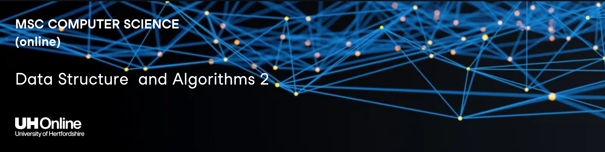

# Data Structure and Algorithms 2 - 7WCM2026-1101-2023

## Final Submission (ref/def)

Due: **Monday, June 17, 2024**
________________________________

 - A document in format .pdf (preferred) with the solutions and
 justifications to ALL the exercises. If you want to create documents by hand and scan/photograph them to add them to the pdf document, please ensure the quality is good and readable. You will need to include the link to your repo and your code in the file.

- A video, preferably in format .mp4, no longer than 10 mins, with the explanation for questions 1 and 2.

### WEIGHTING
This submission is worth 60% of your final mark. The deadline for submitting this is Monday the 17th
June 2024, at 3pm UK time. Please allow for time to submit and take into account the different
timezones if you are submitting from overseas.

As the final submission, in this assignment you will need to demonstrate your knowledge in all the content related to the module: Units 1, 2, 3, 4, 5 and 6.

The code must be your own; you might use functions of libraries such as `ones` or `randint` in `numpy`, but the main code must be your own work.
_______________________________
Lecturer: <a href="https://researchprofiles.herts.ac.uk/en/persons/s%C3%ADlvia-moros-espanol" target="blank">Silvia Moros</a>
